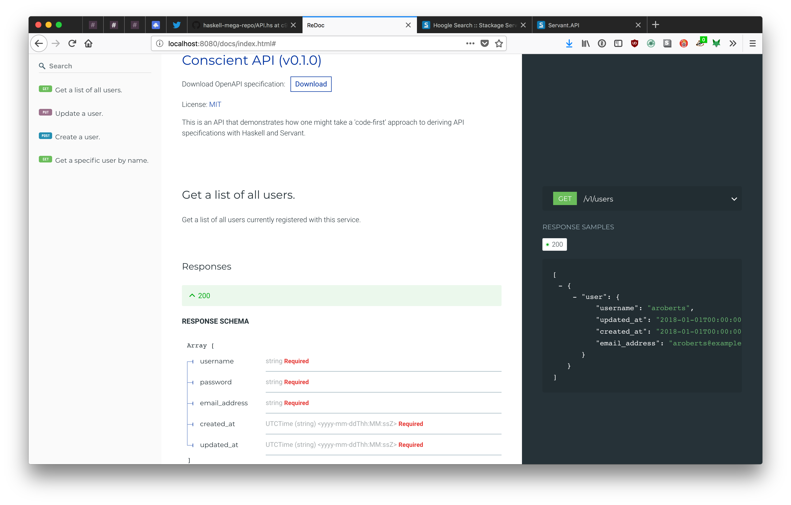

# conscient-api

## Prerequisites

Install the Haskell tool [stack](https://docs.haskellstack.org/en/stable/README/).

## Generate and Serve Swagger Docs

```
stack build
stack exec generate-api-spec
stack exec serve-api-docs
```

Then navigate to `localhost:8080/docs/index.html`.

If all goes well, you should see something similar to the image below:


